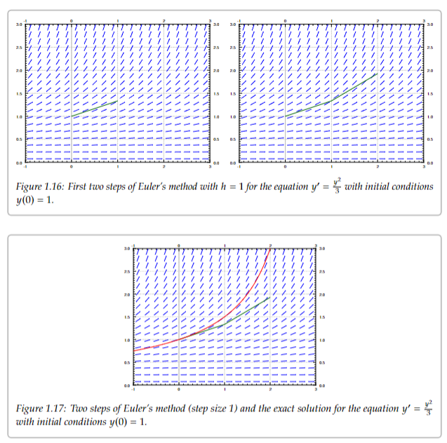

#uoft/mat244 #notes 

Notes for [MAT244](../MAT244.md)

[MAT244 Definitions](MAT244%20Definitions)  
[MAT244 Cheat Sheet](MAT244%20Cheat%20Sheet.md)  
[MAT244 Textbook](attachments/MAT244%20Textbook.pdf)  
[MAT244 Syllabus.pdf](MAT244%20Syllabus.pdf)  
[MAT244 Slides](attachments/MAT244%20Slides.pdf)

[MAT244 Winter Sem Textbook Pirate Link](https://annas-archive.org/md5/ec7e09570313612f2aa60658e1663b05)

---
# Table of Contents
[#Week 1](#Week%201)  
	 [#Preamble](#Preamble)  
	 [#Integrals](#Integrals)  
	 [#Slope Fields](#Slope%20Fields)  
	 [#Separable Equations](#Separable%20Equations)  
	 [#Graphs](#Graphs)  
[#Week 2](#Week%202)  
	[#Euler's Method](#Euler's%20Method)
# Notes
>Find course schedule at [MAT244 Syllabus.pdf](MAT244%20Syllabus.pdf)
## Week 1
> Textbook:  
> 	1.1-1.3  
> 	2.1-2.2  
> Practice Problems  
> 	1.1: #1, 2, 11-16;  
> 	1.2: #3, 5, 6, 8;  
> 	1.3: #1 - 4, 6;  
> 	2.1: 3c, 14b, 20, 28;  
> 	2.2: #1 - 8, 21, 25  
> Topics  
> 	Understand what ODEs are, and associated concepts  
> 	Learn mathematical models and where ODEs come from  
> 	Give graphical and geometric descriptions of solutions of first order ODEs  
> 	Use method of integrating factors to solve linear differential equations  
> 	Apply method for solving separable differential equations
### Preamble
[Differential Equations](Differential%20Equation.md) are equations written with [Derivatives](../../MAT235%20Notes/Derivative.md)  
	They are used very commonly to represent the *laws of physics*

Generally, the "Solution" will refer to the function which when the derivative is taken, results in our [Differential Equation](Differential%20Equation.md)

>An example of a [Differential Equation](Differential%20Equation.md) is $\frac{d x}{d t} +x =2\cos t$  
>	A basic example of a differential equation, involving only the first derivative  
>	In this example, $x$ is the **dependent variable**, and $t$ is the **independent variable**  
>Some examples of ordinary differential equations  
>	

### System of Differential Equations
A [System of Differential Equations](System%20of%20Differential%20Equations) is when we have several [Differential Equation](Differential%20Equation.md) working together

> For example, a [System of Differential Equations](System%20of%20Differential%20Equations) could be  
> 	 $y'=x, x'=y$

There are two different types of [Differential Equations](Differential%20Equation.md)
- [Ordinary Differential Equations](Ordinary%20Differential%20Equations) (Also commonly referred to in the textbook as **ODE**s)
	- Equations where the derivative is taken with respect to only one variable, (only one independent variable)
- [Partial Differential Equations](Partial%20Differential%20Equations) (**PDE**)
	- Equations that depend on [Partial Derivatives](../../MAT235%20Notes/Partial%20Derivative.md) of several variables (several independent variables) 

The **Order** of a [System of Differential Equations](System%20of%20Differential%20Equations) is the order of the largest [Derivative](../../MAT235%20Notes/Derivative.md) that appears

> During this course, we will be interested in *solving differential equations*. That is, finding functions, in which the derivatives has a certain result  
> 	When we solve for differential equations, we are looking for the *family of equations* which satisfies  
> Below are some techniques of solving **First Order Differential Equations**

### Integrals
In the course, we will often be solving **First Order ODEs** in the form  
	$\frac{dy}{dx}=f(x)$, or $y'=f(x)$ 

Generally we are trying to find the function $y(x)$, where $y'(x)=f(x)$  
One technique in order to solve for $y(x)$ is to use the [Integral](../../MAT235%20Notes/Integral.md) of $f(x)$  
We can use the fact that:  
$$y(x)=\int f(x)$$
> Recall that [Integrals](../../MAT235%20Notes/Integral.md) can be used to calculate the **Antiderivative** of a function $f(x)$  
> 	The **Antiderivative** is the family of functions of which the derivative results in $f(x)$

We may also be solving [Differential Equations](Differential%20Equation.md) of the form $y'=f(y)$  
	Be careful not to get these confused with equations in the form $y'=f(x)$, here we are asking a *completely different question*  
	We want to find an equation, which remains the same when derived

When solving equations of this type, do the following.
1. Write the equation in Leibniz notation:  
	$\frac{dy}{dx}=f(y)$
2. use the inverse function theorem from calculus to switch the roles of $x$ and $y$ to get:  
	$\frac{dx}{dy}=\frac{1}{f(x)}$
3. Integrate with respect to y  
	$x(y)=\int \frac{1}{f(y)}dy+C$
4. Isolate for $y$ to find the final equation

### Slope Fields
> The techniques above are very helpful for solving **First Order ODE's**.  
> For an equation of the form $y'=f(x)$, we can find the solution easily with $y=\int f(x)dx+C$  
> However, for Differential Equations of equations of multiple variables like $y'=f(x,y)$, it can be harder to find solutions

A [Slope Field](Slope%20Field) is an equation $y'=f(x,y)$ which gives the slope of $f(x,y)$ at each point in the $(x,y)$-plane (Similar to [Gradient Vectors](../../MAT235%20Notes/Gradient%20Vector.md))  
It creates a 3D graph where each point gives the slope of $f(x,y)$ at that position  
	This type of equation is called a [Slope Field](Slope%20Field)

> By looking at a slope field, we can gain insight into the behavior of solutions for the graph, without having to solve the equation  
> An graphical example of slope fields  
> 	  
> 	The right graph shows the graph of various solutions, note how they follow the path of the slope field  
>In interpreting these graphs, remember that the solution of a differential equation is typically a *family* of equations  
>	Imagine the family as the result of the differential with different **starting points**
### Separable Equations
We say a [Differential Equation](Differential%20Equation.md) is [Separable](Separable) if we can write it as  
$$y'=f(x)g(y)$$  
	If we can separate an equation in this way, we can use the equations to solve for $y$:  
		$\frac{dy}{g(y)}=f(x)dx \text{ and } \int \frac{dy}{g(y)}=\int f(x)dx$  
		Solve for the right integral, and isolate $y$ to find its equation

>Leibnitz notation and freaky derivative stuff  
>	In order to get equations into the proper form with 	$\frac{dy}{g(y)}=f(x)dx \text{ and } \int \frac{dy}{g(y)}=\int f(x)dx$, and to solve for many equations of $y'=y$, you must be comfortable with moving $\frac{dx}{dy}$ around, almost as if doing algebra with them  
>An example of calculating the integral using this technique  
> 	  
> 	

Sometimes it can be difficult to isolate for $y$ after integrating, and we may leave the solution in the integrated, non-isolated form.  
	When we do this, it is called the [Implicit Solution](Implicit%20Solution)

### Graphs
One solutions for solving [Differential Equations](Differential%20Equation.md), is to simulate and graph the formula $y'=f(x)$ without calculating the graph $y(x)$  
We can do this by translating the equations into programs such as [Excel](Excel)

## Week 2
> Textbook:  
> 	2.4, 2.6  
> Practice Problems  
> 	2.4: #1 -4, 5-8, 9-12, 23-25;  
> 	2.6: #1 -8, 9-10, 14, 15-16, 18-21  
> Topics  
> 	Understand fundamental differences between linear and nonlinear first order ODE's  
> 	Understand conditions for existence and uniqueness of solutions to first order IVPs  
> 	Compute intervals of existence and uniqueness of solutions to IVPs  
> 	Apply method to solve exact differential equations

Unless the equation is in the a [Separable](Separable) form, It is generally very hard, if not impossible to get a nice formula for the solution of the problem  
$$y'=f(x,y), \ \ \ y(x_{0})=y_{0}$$  
	That is, get the antiderivative of $y'$ with respect to only $x$

### Euler's Method
[Euler's Method](Euler's%20Method) says to take the derivative at various points, to try to approximate the graph of the solution

**Euler's Method**
- Choose an initial value $x_{0}$ and $y_{0}$, pick an interval $h$, and compute the slope $k=f(x_{0},y_{0})$
- Follow the line for an interval of length $h$ on the x-axis
- If $y=y_{0}$ at $x_{0}$, then the value of $y_{1}$ at $x_{1}=x_{0}+h$ is $y_{1}=y_{0}+hk$
- Repeat to approximate graph 

> An example of using Euler's Method with $h=1$ for the equation $y'=\frac{y^{2}}{3}$ with initial condition $y(0)=1$  
> 	

> Euler's Method is not always ideal, it has trouble capturing limits at a point which go to infinity, as well as solutions which oscillate near some point  
> When choosing a method, there are various factors to consider  
> 	Computational Time  
> 	Roundoff errors  
> 	Stability

## Week 3
> Textbook: 2.1,3.1  
> Topics: Lotka-Volterra Models, Multi-dimensional Euler's Method, Phase Portraits

As covered above, a [System of Differential Equations](System%20of%20Differential%20Equations) is when we have a system of several [Differential Equations](Differential%20Equation.md) related to one another, and the the **Order** of a [System of Differential Equations](System%20of%20Differential%20Equations) is the order of the largest [Derivative](../../MAT235%20Notes/Derivative.md) that appears.

> An example of a *first order system* and a *second order system* is  
> 	$\begin{aligned} x_{1}' &= g_{1}(x_{1},x_{2},x_{3},t) \\ x_{2}' &= g_{2}(x_{1},x_{2},x_{3},t) \\ x_{3}'&=g_{3}(x_{1},x_{2},x_{3},t)\end{aligned}$  
> Here, $t$ is the *independent* variable, and $x_{1},x_{2},x_{3}$ are the *dependent* variables  
> 	An example of the **solution** of the first order system above, would be the set of three functions $x_{1}(t), x_{2}(t)$, and $x_3(t)$ which fulfils the system above 

A system where the equations do not depend on the independent variable is called an [Autonomous System](Autonomous%20System)

A two-dimensional [Autonomous System](Autonomous%20System) is a system defined as:  
$$x'=f(x,y), \ \  \ \ \ y'=g(x,y)$$  
where $f(x,y)$ and $g(x,y)$ are functions of two variables, and the derivatives are taken with respect to the independent value $t$

Solutions are function $x(t)$ and $y(t)$ such that  
$$x'(t)=f(x(t),y(t)), \ \ \ \ \ \ y'(t)=g(x(t),y(t))$$

> Example of an [Autonomous System](Autonomous%20System)  
> 	$x'=2y-x$, and $y'=x$ with the independent variable $t$  
> Note that $t$ does not appear in either equation.  
> You can conceptualize this as a system where the exact value $t$ does not matter. What defines $y$ and $x$ is their relationship to one another, and $t$ is only important in the the relative "time" which passes after setting an initial condition

For [Autonomous Systems](Autonomous%20System), similar to a [Slope Field](Slope%20Field), we can use a [Direction Field](Direction%20Field) to analyze solutions.  
Instead of giving the slope of the equation such as in the [Slope Field](Slope%20Field), it graphs the direction and magnitude of the derivatives, at different points

This concept can also be referred to as a [Phase Diagram](Phase%20Diagram), and can be more rigorously defined for a **Two-Dimensional [Autonomous System](Autonomous%20System)** as:  
	The [Vector Field](Vector%20Field), given at each point $(x,y)$ by the vector $\begin{bmatrix} f(x,y) \\ g(x,y)\end{bmatrix}$  
		Where $x'=f(x,y)$, and $y'=g(x,y)$
	

> Example of Direction Field/Phase Diagram  
> 	With the example $x'=2y-x$ and $y'=x$, we are graphing the Vector $(2y-x,x)$ at different $y$ and $x$ values  
> Graphical Examples  
> 	  
> 	

## Week 4
> Textbook 1.6

## Week 5
> Textbook 2.2-2.3
## Week 6
> Textbook 2.4